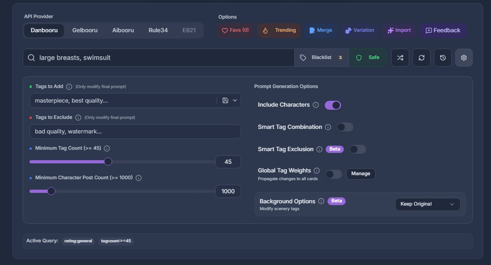
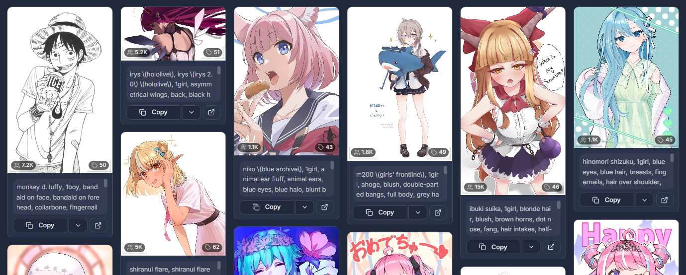

# Booru Prompt Gallery

[](LICENSE)
[](https://nextjs.org/)
[](https://www.typescriptlang.org/)

**A multi-provider image gallery that extracts and cleans booru tags into ready-to-use prompts for AI art generation (Illustrious, Pony, SDXL).**

[🌐 Live](https://booru-prompt-gallery.netlify.app) · [📝 Changelog](https://civitai.com/articles/17747) · [☕ Support](https://ko-fi.com/mexes)

---

## What is this?

Booru Prompt Gallery takes posts from digital art websites (Danbooru, Gelbooru, e621, Aibooru, Rule34), extracts their tags, cleans them, and formats them into ready-to-copy prompts. It's designed for LoRA trainers and AI artists who need varied, high-quality prompts quickly.

Instead of manually copying tags from a booru post and cleaning them by hand, you search for a character or concept, browse the results, and copy a clean prompt in one click.

### Screenshots





---

## Features

### 🔍 Search & Discovery

- **Multi-provider support** — Danbooru, Gelbooru, e621, Aibooru, and Rule34. Switch between them to access different content pools.
- **Tag search** — Search by character, action, clothing, or any booru tag. Autocomplete helps you find the correct tag format.
- **Random mode** — Get varied results instead of always seeing the latest posts.
- **Blacklist** — Exclude tags you don't want to see.
- **Content filter** — Toggle explicit content on/off with one click.

### 🧹 Prompt Cleaning

- **Tag extraction** — Removes irrelevant metadata, artist tags, rating tags, and redundant information.
- **Smart Tag Exclusion** — 180+ rules that prevent contradictory tags (e.g., a character seen "from behind" won't have "lips" or "cleavage").
- **Category filtering** — Tags are categorized into: **Appearance, Clothing, Pose, Background, Character**. Copy only the categories you need.
- **Smart tag combination** — Merges redundant tags: "hair, long hair, white hair" → "long white hair".
- **Tag removal** — Remove persistent unwanted tags from all prompts (e.g., "solo", "realistic").
- **Minimum tag count** — Only show prompts with enough detail (recommended: 20-30 tags).

### 🎨 Prompt Customization

- **Tags to add** — Inject tags into every prompt. Perfect for LoRA trigger words or style tags ("sketch", "photorealistic").
- **Presets** — Save and load multiple tag packs for different LoRAs or styles.
- **Global Tag Weights** — Assign weights to tags globally. A tag weighted at 1.5 will automatically apply `(tag:1.5)` across all cards.
- **Per-tag weights** — Click any tag to increase or decrease its weight individually.
- **Include/Exclude Character** — Toggle whether character tags appear in the final prompt.

### 📋 Modes

- **Favorites** — Save posts to folders. Syncs across devices via Supabase.
- **Trending** — See what's popular today. Click cards to send them to the search engine.
- **Merge** — Combine categories across multiple posts. Mix character from card A + clothing from card B + background from card C.
- **Feedback** — Report bugs or request features directly from the app.

### 🖼️ Background Options

- **Keep Original** — Leave background tags as-is.
- **Remove All** — Strip all background tags (simple colors + detailed scenery).
- **Replace** — Remove backgrounds, inject your own custom replacement tags.
- **Simple Random** — Generate a unique, coherent simple background per card (color/gradient/pattern) derived from the image's dominant colors via color theory.
- **Detailed Random** — Swap the background for a full scenery set (e.g. `indoors, night, window`) sampled from a curated dataset.

> Random modes are **seeded per card** (by post id), so each card gets a stable background that stays consistent between the on-card preview and every copy action.

### ⚡ Quick Actions

- **Random button** — Fetch random content to avoid seeing the same results.
- **Refresh button** — Reload results for new posts.
- **History panel** — Timeline of all tags you've copied.
- **Image download** — Download images directly for ControlNet or IP-Adapter.
- **One-click copy** — Copy full prompt or specific categories with a single click.

### 👥 Community

- **Teach Panel** — Help categorize tags. Suggestions go through an LLM verification system before human review.

---

## Tech Stack

| Category | Technology |
|----------|-----------|
| Framework | Next.js 15 (App Router) |
| Language | TypeScript (strict mode) |
| Styling | Tailwind CSS + shadcn/ui |
| Data Fetching | SWR with infinite scroll |
| Database | Supabase (PostgreSQL) |
| Image Proxy | Cloudflare Workers (edge cache) |
| Error Tracking | Sentry |
| Auth | Supabase Auth (magic links) |
| Animation | Framer Motion |

---

## Quick Start

```bash
git clone https://github.com/Mexes-GM/booru-prompt-gallery.git
cd booru-prompt-gallery
npm install
npm run dev
```

Open [http://localhost:3000](http://localhost:3000). That's it — no `.env` file needed.

> **You don't need to configure anything for local use.** The app fetches directly from public booru APIs (Danbooru, AIBooru, etc.) from your browser. Search, browse, copy prompts, and save favorites (stored in your browser's localStorage) all work out of the box with zero setup.

## Environment Variables (production deployment only)

All environment variables are **optional for local development**. They are only needed when deploying to production (Vercel, Netlify) to enable multi-user features.

See [`.env.example`](.env.example) for the full list. Here's what each one does and what happens without it:

| Variable | Purpose | What happens without it |
|----------|---------|------------------------|
| `NEXT_PUBLIC_SUPABASE_URL` + `NEXT_PUBLIC_SUPABASE_ANON_KEY` | Multi-device favorites sync + auth | Favorites save to localStorage (anonymous mode); admin panel disabled |
| `SUPABASE_SERVICE_ROLE_KEY` | Server-side admin operations | Admin panel disabled; graceful no-op fallback |
| `NEXT_PUBLIC_IMAGE_PROXY_URL` | Cloudflare Worker for image proxying and API routes | Uses same-origin `/api/*` routes — works fine locally |
| `UPSTASH_REDIS_REST_URL` + `UPSTASH_REDIS_REST_TOKEN` | Server-side rate limiting | In-memory fallback (production); disabled entirely in dev mode |
| `NEXT_PUBLIC_SENTRY_DSN` + `SENTRY_AUTH_TOKEN` | Error tracking | Disabled — Sentry only activates when `NODE_ENV=production` |
| `DANBOORU_USERNAME` + `DANBOORU_API_KEY` | Higher Danbooru rate limits (server-side) | Client fetches directly from Danbooru's public API — works without keys |
| `OPENROUTER_API_KEY` / `DEEPSEEK_API_KEY` | AI-powered tag classification | Manual tag classification still works |
| `DISCORD_FEEDBACK_WEBHOOK_URL` | Feedback form submissions | Feedback form silently disabled |
| `ADMIN_PASSWORD` | Admin panel access | Admin panel inaccessible (irrelevant for local use) |

**Bottom line**: `npm install && npm run dev` is all you need.

## Project Structure

```
app/               → Next.js App Router (pages + API routes)
components/
  ui/              → shadcn/ui primitives
  prompt-gallery/  → Gallery-specific components
lib/
  booru/           → Provider implementations (strategy pattern)
  network/         → HTTP client with retries + rate limiting
hooks/             → Custom React hooks
scripts/           → Utilities (seeding, tag analysis)
workers/           → Cloudflare Workers (image proxy)
supabase/          → Database schema + migrations
__tests__/         → Test suite
```

## Commands

| Command | Description |
|---------|-------------|
| `npm run dev` | Start dev server |
| `npm run build` | Production build |
| `npm run lint` | Run linter |
| `npx ts-node --project __tests__/tsconfig.json __tests__/<name>.verify.ts` | Run a test suite (e.g. `background-options.verify.ts`) |

## Architecture

### Provider System
Each booru provider implements `IBooruProvider` (Strategy pattern). `lib/booru/factory.ts` instantiates the correct provider based on user selection.

### Smart Tag Exclusion
`lib/tag-conflicts.ts` — 180+ trigger rules preventing contradictory tag combinations. 95.3% coverage across 43 tag families.

### Image Proxy
Danbooru + Gelbooru images route through a Cloudflare Worker for caching and hotlink protection. Other providers serve directly from their CDNs to avoid bandwidth costs.

### Prompt Pipeline
1. Raw post tags → `cleanPrompt()` removes metadata, ratings, deprecated tags
2. Category system separates tags into Appearance / Clothing / Pose / Background / Character
3. Smart tag combination merges redundant modifiers
4. Tag conflicts resolved (e.g., "from behind" blocks frontal anatomy tags)
5. Background options applied
6. Global and per-tag weights applied
7. Final prompt ready to copy

## API Providers

| Provider | Content | Status |
|----------|---------|--------|
| Danbooru | Anime/illustration (best tagging) | ✅ Recommended |
| Gelbooru | Anime/illustration | ✅ |
| e621 | Furry | ✅ |
| Aibooru | AI-generated art | ✅ |
| Rule34 | Explicit content | ✅ |

---

## Contributing

See [CONTRIBUTING.md](CONTRIBUTING.md). PRs welcome!

## License

MIT — see [LICENSE](LICENSE).
