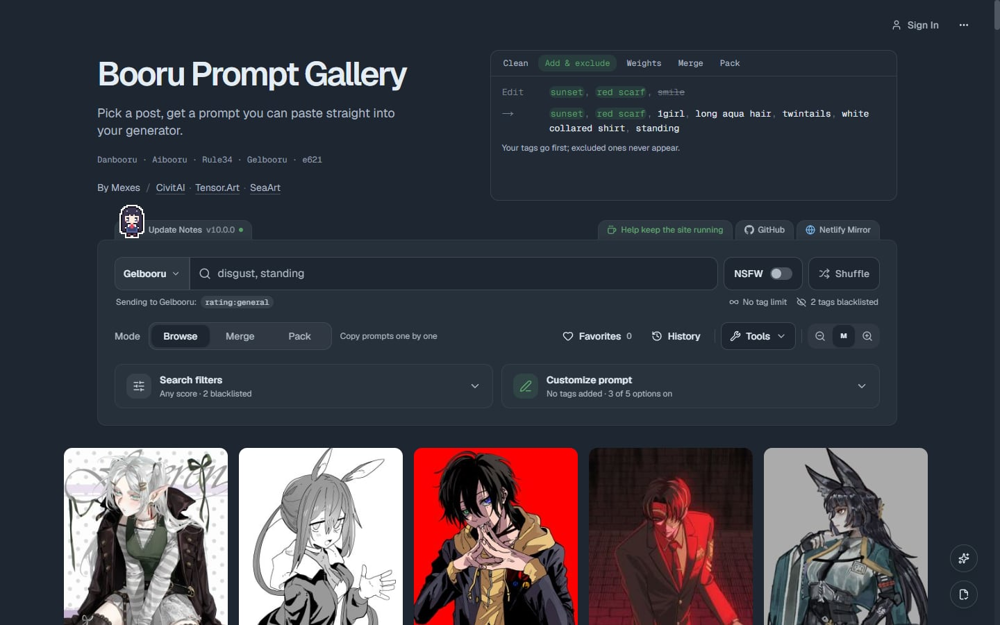
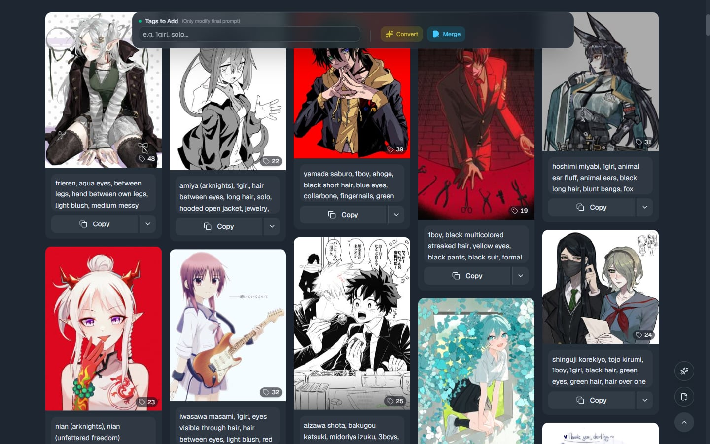
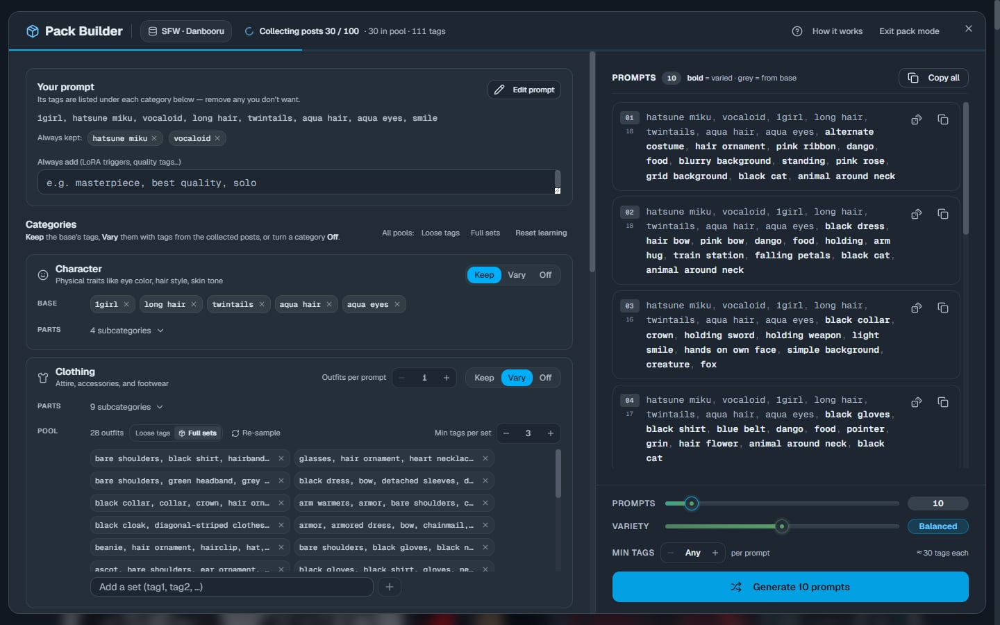

# Booru Prompt Gallery

[](LICENSE)
[](https://nextjs.org/)
[](https://www.typescriptlang.org/)

**Pick a post, get a prompt you can paste straight into your generator.**

[🌐 Open the app](https://booru-prompt-gallery.vercel.app) · [🪞 Mirror](https://booru-prompt-gallery.netlify.app) · [📝 Changelog](https://civitai.com/articles/17747) · [☕ Buy me a coffee](https://buymeacoffee.com/Mexes)



---

## What is this?

I make LoRAs and checkpoints, and I was spending way too much time writing prompts to test them. Booru sites like Danbooru already have millions of images described tag by tag, so I built a tool that grabs those tags and turns them into clean, ready-to-use prompts.

You search for a character, an outfit, a pose or anything else, scroll through real posts, and copy a prompt with one click. The app throws away the stuff that hurts your generations (artist names, metadata, "white background", watermarks...), merges redundant tags and avoids contradictions, so what you copy is something your model can actually use.

It works with Illustrious, Pony, SDXL, Anima and pretty much any tag-based checkpoint.



---

## What you can do with it

### Browse and copy

- **Five sites in one place**: Danbooru, Gelbooru, e621, Aibooru and Rule34.
- **Tag autocomplete**: covers ~145,000 Danbooru tags, aliases included.
- **Score Floor**: skip low-score posts, which tend to be tagged worse.
- **Blacklist and Shuffle**: hide tags you never want to see, or get random results instead of the latest posts.
- **Copy by category**: copy the whole prompt, or only the character, the clothing, the pose or the background.

### Clean prompts

- **Tag cleaning**: removes artist names, ratings, metadata and tags that restrict the generation.
- **Smart Tag Combination**: `hair, long hair, white hair` becomes `long white hair`.
- **Smart Tag Exclusion**: 180+ conflict rules, so a character seen "from behind" doesn't also get tags that only make sense from the front.
- **Background Options**: keep the original background, remove it, replace it with your own tags, or randomize it (simple colors and gradients, or full detailed scenes).

### Make them yours

- **Tags to Add / Exclude**: put your LoRA triggers or quality tags at the start of every prompt, or drop tags you never want. Save your setups as **Tag Presets**.
- **Find & Replace / Find & Append**: swap tags for others, or build rules like "when a prompt has X, append Y" with a visual block editor.
- **Weights**: set a tag's weight once and it applies to every card.
- **Prepend Artist (@artist)**: start the prompt with the post's artist to copy their style (Anima only).

### Modes

- **Merge**: character from one card, outfit from another, background from a third. Includes Variations (`{ a | b }` wildcards).
- **Pack Mode**: pick a base card or paste your own prompt and get a whole batch around it. Choose what stays fixed, how much the rest varies, and re-roll any prompt you don't like.
- **AI Convert**: turn tag prompts into natural language. 10 free requests a day, or unlimited with your own API key.
- **Favorites and History**: save posts into folders (synced if you sign in) and find anything you copied.



---

## How tags get their categories

Every tag in a prompt belongs to one of **7 categories**: Appearance, Clothing, Equipment, Pose, Scenery, Creature and Other. Each category is split into subcategories, **33 in total**: hair, eyes, top, bottom, footwear, weapon, handheld, expression, camera angle, setting, props, style and so on.

Copy by category, Merge, Background Options and Pack Mode all rely on it. It's how Pack Mode knows not to give a character two skirts or three weapons.

The ~145,000 Danbooru tags were classified with [Jev](https://typesafe.ai), an AI model from TypeSafe. The ambiguous ones (is `flower` in her hair, in her hand or in the background?) go to **Quick Teach**, where users confirm or correct Jev's guess.

---

## Supported sites

| Site | Content |
|------|---------|
| Danbooru | Anime / illustration (best tagging, recommended) |
| Gelbooru | Anime / illustration |
| e621 | Furry |
| Aibooru | AI-generated art (prompts come from the image metadata) |
| Rule34 | Mixed |

---

## Running it yourself

You'll need **Node.js 24.12+** and **npm**.

```bash
git clone https://github.com/Mexes-GM/booru-prompt-gallery.git
cd booru-prompt-gallery
npm install
cp .env.example .env.local
```

The app gets its data (posts, tags, favorites, AI Convert) from a small Cloudflare Worker that lives in `workers/booru-image-proxy`. Run it in a second terminal:

```bash
cd workers/booru-image-proxy
npm install
npx wrangler dev
```

Then open `.env.local`, point `NEXT_PUBLIC_IMAGE_PROXY_URL` at the worker (`http://localhost:8787` by default) and start the app:

```bash
npm run dev
```

Open [http://localhost:3000](http://localhost:3000).

### Environment variables

Only the worker URL is required. Everything else switches itself off when missing:

| Variable | What it enables | Without it |
|----------|-----------------|------------|
| `NEXT_PUBLIC_IMAGE_PROXY_URL` | Data API + image proxy (the worker) | **Required.** Nothing loads. |
| `NEXT_PUBLIC_SUPABASE_URL` + `NEXT_PUBLIC_SUPABASE_ANON_KEY` | Sign in, synced favorites, tag categories, Teach | Favorites stay in your browser; no account features. |
| `SUPABASE_SERVICE_ROLE_KEY` | Admin panel and server-side writes | Admin panel disabled. |
| `UPSTASH_REDIS_REST_URL` + `UPSTASH_REDIS_REST_TOKEN` | Rate limiting | In-memory fallback. |
| `DANBOORU_USERNAME` + `DANBOORU_API_KEY` | Higher Danbooru rate limits | Public API limits. |
| `NEXT_PUBLIC_CDN_PROXY_URL` | CDN for Danbooru images | Images go through the app's own download route. |
| `NEXT_PUBLIC_POSTHOG_KEY` | Analytics | Disabled. |
| `DISCORD_FEEDBACK_WEBHOOK_URL` | Feedback form | Feedback form disabled. |

Full list with comments in [`.env.example`](.env.example). The worker's own (optional) secrets are listed in `workers/booru-image-proxy/wrangler.toml`, and the database schema is in `supabase/migrations/`.

### Useful commands

| Command | What it does |
|---------|--------------|
| `npm run dev` | Start the dev server |
| `npm run build` | Production build |
| `npm test` | Run the tests |

---

## Under the hood

| | |
|---|---|
| Framework | Next.js 16 (App Router), React 19 |
| Language | TypeScript 6 (strict) |
| Styling | Tailwind CSS 4 + shadcn/ui, Framer Motion |
| Data | SWR, Cloudflare Worker (data API + image proxy) |
| Database & auth | Supabase (PostgreSQL, magic-link login) |

```
app/                  → pages, admin panel and server actions
components/
  prompt-gallery/     → the gallery, cards, panels and modes
  ui/                 → shadcn/ui primitives
lib/
  cleanPrompt.ts      → prompt cleaning and tag combination
  tag-conflicts.ts    → Smart Tag Exclusion rules
  tag-taxonomy.ts     → the 7 categories and 33 subcategories
  prompt/             → how a post becomes a prompt
  pack/               → Pack Mode generator and learning
  booru/              → site URLs, tag limits and helpers
hooks/                → React hooks (search, favorites, modes...)
workers/              → the Cloudflare Worker
supabase/             → database migrations
scripts/              → data and classification scripts
__tests__/            → verification tests
```

---

## Contributing

Found a bug or have an idea? Open an issue or leave a comment on the [Civitai article](https://civitai.com/articles/17747). PRs are welcome, see [CONTRIBUTING.md](CONTRIBUTING.md).

## Support

The app runs on free hosting, so if it's ever down, that's probably why. If you want to help keep it running, you can [buy me a coffee](https://buymeacoffee.com/Mexes).

## License

AGPL-3.0, see [LICENSE](LICENSE).

You're free to use, modify and self-host it. If you run a modified version as a public service, you have to share your changes under the same license.
